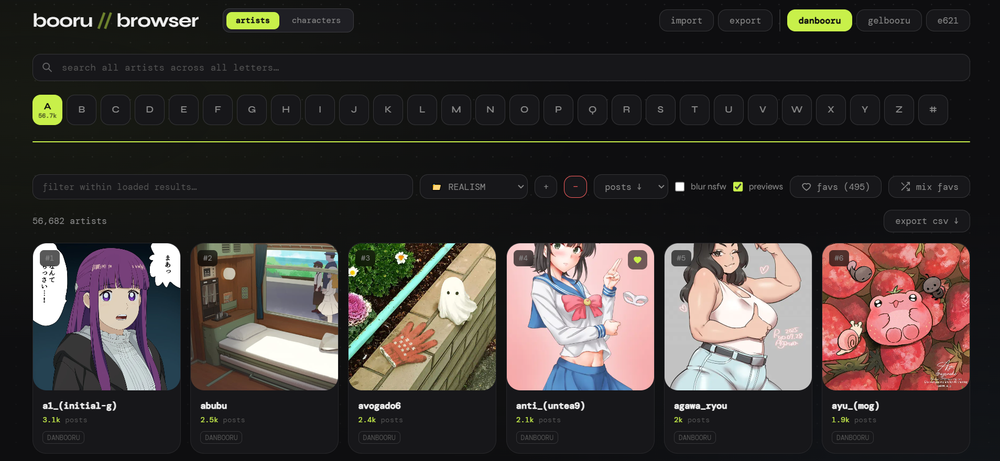
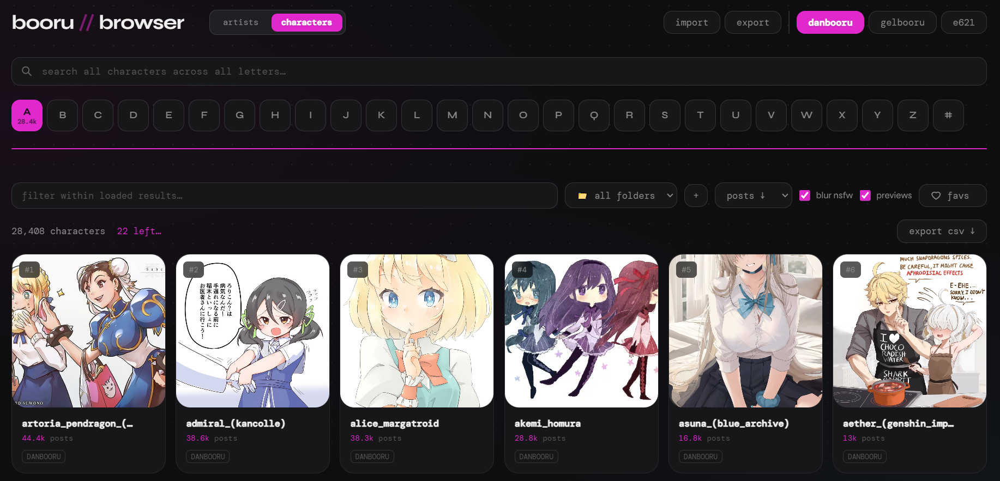
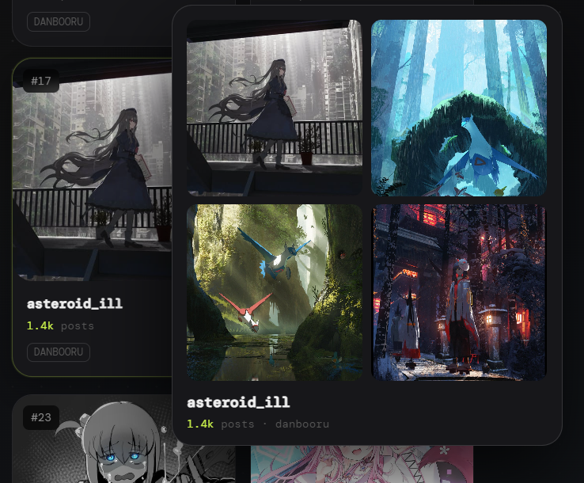
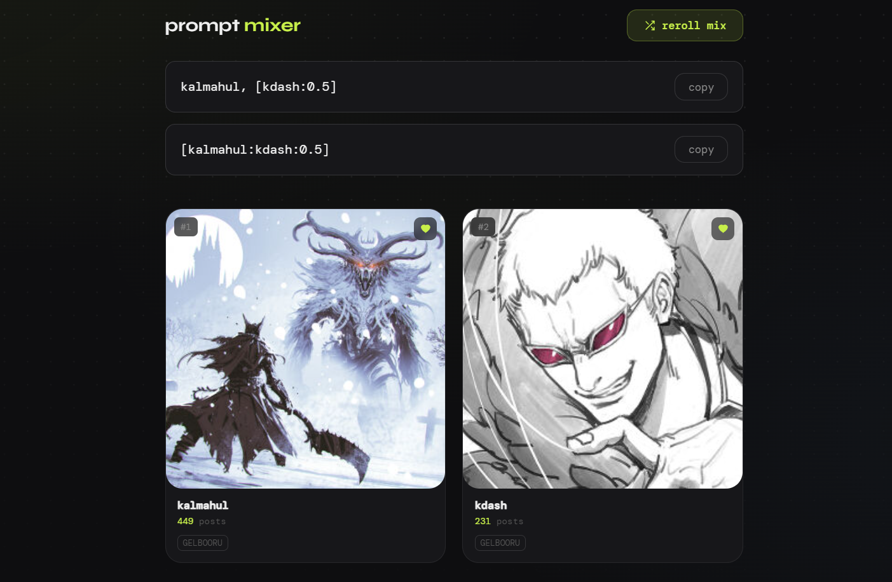

# Booru Browser

> **A Quick Note from the Author**
> 
> Hello! Before anything else, I want to be completely transparent: I am a hobbyist, and my programming knowledge is quite limited. This entire tool was written with the heavy assistance of AI.
> 
> I sincerely apologize for any vulnerabilities, structural inconsistencies, or amateur mistakes that an experienced eye will undoubtedly catch. I did my absolute best to debug, test, and study the code within the limits of my abilities. 
> 
> I originally created this browser strictly for my personal workflow. I am sharing it with the community purely out of goodwill, hoping it might be genuinely useful to someone else. Because of my lack of technical expertise, I cannot take responsibility for maintaining, updating, or providing ongoing support for this project. 
> 
> If you have the skills and the desire to fork this project, integrate it into environments like ForgeUI or ComfyUI, or simply rewrite it into proper piece of code — please go ahead! I wholeheartedly encourage you to take this foundation and evolve it. I would be absolutely thrilled to see it grow in the hands of someone who knows what and how to do it.

A local browser tool for exploring artists on Danbooru, Gelbooru or e621 — with image previews, hover cards, favorites, prompt mixing, sorting, and global search.





---

## Files

| File                    | Purpose                                                     |
|-------------------------|-------------------------------------------------------------|
| `booru_browser.html`    | The main browser interface.                          |
| `booru_proxy.py`        | Local proxy server, must be running for everything to work. |
| `auth.json`             | Your API credentials (see setup below).                     |

---

## Setup

### 1. Get API credentials

**Danbooru** (required)
1. Register at https://danbooru.donmai.us/users/new
2. Go to https://danbooru.donmai.us/profile → scroll to **API Key** → create one
3. Note your **username** and the generated **API key**

**Gelbooru** (required for Gelbooru tab)
1. Register/log in at https://gelbooru.com
2. Go to https://gelbooru.com/index.php?page=account&s=options
3. Note your **User ID** and **API Key**

**e621** (optional, required for viewing NSFW content)
1. Register/log in at https://e621.net
2. Go to Account → Manage API Access
3. Note your **Username** and **API Key**

### 2. Create auth.json

Create a file called `auth.json` in the same folder as `booru_proxy.py`:

```json
{
  "login": "your_danbooru_username",
  "api_key": "your_danbooru_api_key",
  "gb_user_id": "your_gelbooru_user_id",
  "gb_api_key": "your_gelbooru_api_key",
  "e621_login": "your_e621_username",
  "e621_api_key": "your_e621_api_key"
}
```

> If you only use Danbooru, the `gb_user_id`, `gb_api_key` and e621 lines are optional.

Alternatively, you can pass Danbooru credentials directly on the command line (no `auth.json` needed):

```
python booru_proxy.py YOUR_USERNAME YOUR_API_KEY
```

### 3. Start the proxy

**Windows** — open Command Prompt in the folder and run:
```
python booru_proxy.py
```

**Mac / Linux** — open Terminal in the folder and run:
```
python3 booru_proxy.py
```

Keep this window open while using the browser tool. Stop it with `Ctrl+C`.

### 4. Open the browser

**Open via the proxy:**
Navigate to `http://localhost:8765` in your browser. The proxy serves the HTML file automatically. 

You should see a green **✓ proxy connected** banner at the top.

---

## Phone / tablet access

When the proxy starts, it prints two URLs in the terminal — one for your PC and one for your local network:

```
On this PC:  http://localhost:8765
On phone:    http://192.168.x.x:8765
```

Open the phone URL in your phone's browser while both devices are on the same Wi-Fi to use the tool on mobile.

---

## Features

### App Switcher
- Instantly switch between the Artists and Characters databases.
- Both tools share the same proxy but keep their folders, favorites, and cache completely separated to prevent data mixing.

### Browsing
- Click a letter button to load all artists starting with that letter
- Letters show a count badge after loading (e.g. `S 2.4k`)
- Switch between **Danbooru** and **Gelbooru** using the tabs in the top right

### Search
- **Global search** (top bar) — searches the API directly across all artists, shows results as you type
- **Filter** (lower bar) — filters within already-loaded results for the current letter

### Previews
- Thumbnails load automatically when a letter is selected
- **Hover** over any card for 400ms to see a 4-image preview panel
- Toggle **blur nsfw** to blur images flagged as non-safe
- Toggle **previews** off to hide all thumbnails



### Sorting
Use the sort dropdown to order by:
- Posts ↓ (default — most posts first)
- Posts ↑
- Name A→Z
- Name Z→A

### Folders & Favorites
- Click the ★ star button on any card to favorite an artist.
- Organize favorites into custom folders using the dropdown menu and + / − buttons.
- If a specific folder is selected, newly starred artists will go directly there.
- Move an artist to a different folder using the mini-dropdown directly on their card (visible in the "favs" tab).
- Favorites and folders are saved locally in your browser.

### Prompt Mixer
- Click **mix favs** in the controls bar to open the Prompt Mixer
- It randomly picks 2 artists from your current view (from all favorites, or from a specific folder if selected).
- Generates prompts combinations with proper syntax formatting for Stable Diffusion.
- Click **copy** next to either prompt to copy it to your clipboard
- Click **reroll mix** to get a new random pair
- Requires at least 2 favorited artists



### Smart Copy
- Artists: Hover over a card and click the clipboard icon to copy the artist's name.
- Characters: It automatically pulls the copyright name (if available from the preview load) and formats it properly for prompting.

### Export
- Click **export csv ↓** to download the current results as a CSV file

---

## Mobile

On small screens (≤600px), the standard controls bar is replaced by a fixed bottom bar containing:
- A **filter** search field
- A **sort** dropdown
- A **blur nsfw** icon toggle
- A **favorites** icon toggle
- A **mix favs** icon button

The hover preview card is hidden on mobile.

---

## Keyboard shortcuts

| Key | Action |
|---|---|
| `←` / `→` | Previous / next page |
| `↑` / `↓` | Previous / next page (also works) |
| `A` – `Z` | Jump to that letter |
| `F` | Toggle favorites view |
| `Escape` | Clear the name filter (or exit mix view) |

---

## Disk cache

Disk Cache & Loading Times
Loaded tag lists are automatically saved to a .tag_cache/ folder next to the proxy script. On subsequent visits, letters load instantly from cache instead of fetching from the API.

Important note on API Rate Limits:

- Danbooru: Loads extremely fast (1000 tags per request).

- Gelbooru: Has a strict rate limit (100 tags per request). The proxy adds a mandatory 0.33s delay between requests.

- e621: Has very aggressive anti-bot protection. The proxy enforces a strict 2s delay between requests to prevent your IP from being banned. The first time you load a popular letter on e621, it may take several seconds. 

To force a fresh fetch (to pick up newly added artists/characters), simply delete the relevant file from .tag_cache/ (e.g., e621_S.json or danbooru_char_A.json).
---

## Troubleshooting

**"Proxy not detected"** — the proxy isn't running. Start it with `python booru_proxy.py`.

**"no api credentials"** — `auth.json` is missing or in the wrong folder. It must be in the same folder as `booru_proxy.py`. Alternatively, pass credentials on the command line: `python booru_proxy.py USERNAME API_KEY`.
